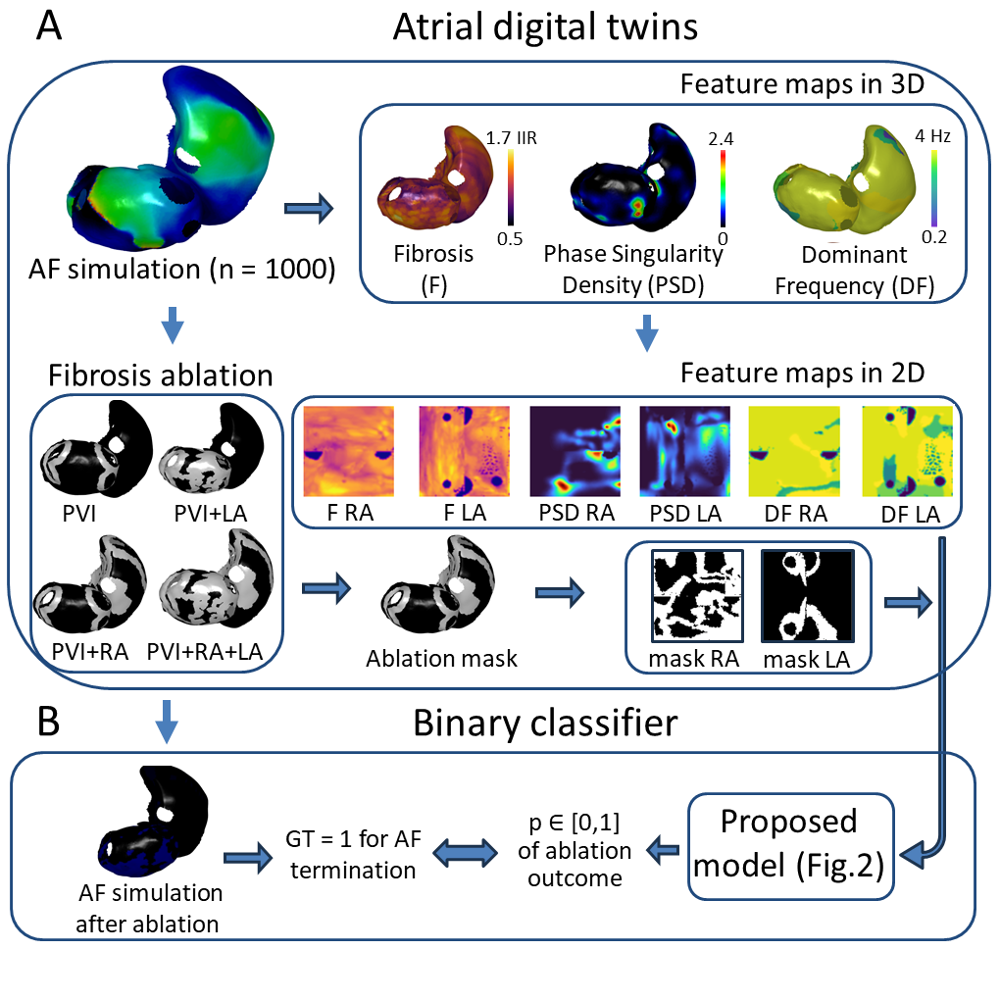
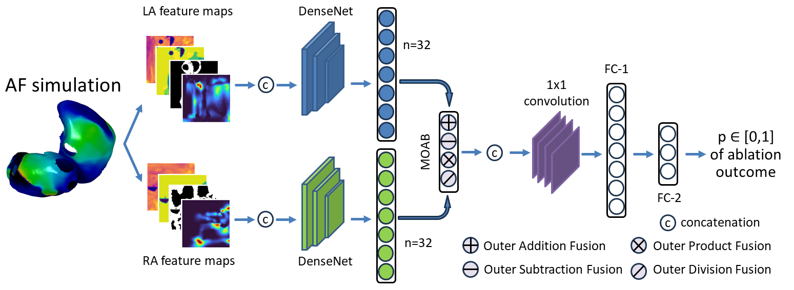

### Predicting Atrial Fibrillation Treatment Outcome with Siamese Multi-modal Fusion and Digital Twins

The paper was presented at Medical Imaging with Deep Learning conference (MIDL 2024).

  ### Abstract
  
Atrial fibrillation, the most common heart rhythm disorder, presents challenges in treatment due to difficulty pinpointing the patient-specific regions of abnormal electrical activity. 
While biophysical simulations of cardiac electrophysiology create a digital twin of atrial electrical activity based on CT or MRI scans, testing various treatment strategies on them is time-consuming and impractical on clinical timescales.
Our proposed pipeline, incorporating Siamese architecture, fuses latent representations of multi-modal features extracted from atrial digital twin before any therapy and predicts the outcomes of several treatment strategies.
A large in-silico dataset of 1000 virtual patients, generated from clinical data, was utilized to provide the biophysical simulations before (used for feature extraction) and after (used for calculating ground truth labels depending on whether atrial fibrillation terminates or not) various treatment strategies.  
By accurately predicting freedom from atrial fibrillation, our pipeline paves the way for personalized atrial fibrillation therapy with a fast and precise selection of optimal treatments.



### Proposed architecture

To address the problem of fast and correct prediction of AF ablation, we propose a DL pipeline based on Siamese architecture.
Each head consists of DenseNet121 network and utilises 4 channel-wisely concatenated feature maps (all of the size 128 by 128 pixels) from left and right atrium separately.
The outputs of both heads (n = 32 each) were fed into a Multi-modal Outer Arithmetic Block (MOAB) for the fusion of latent representations of features.
It allows us to capture and combine the relevant features from different anatomical structures by applying four arithmetic operations. 
The resulting arrays were concatenated into multi-modal tensor which passed through the 2D convolution layer.
The final prediction of AF ablation outcome as the probability of AF termination was achieved through two successive fully-connected layers (n = 1089 and 512 respectively) and one dropout layer.



## Running code 

```
python3 ablation_pred.py config.yaml name_of_experiment
```
