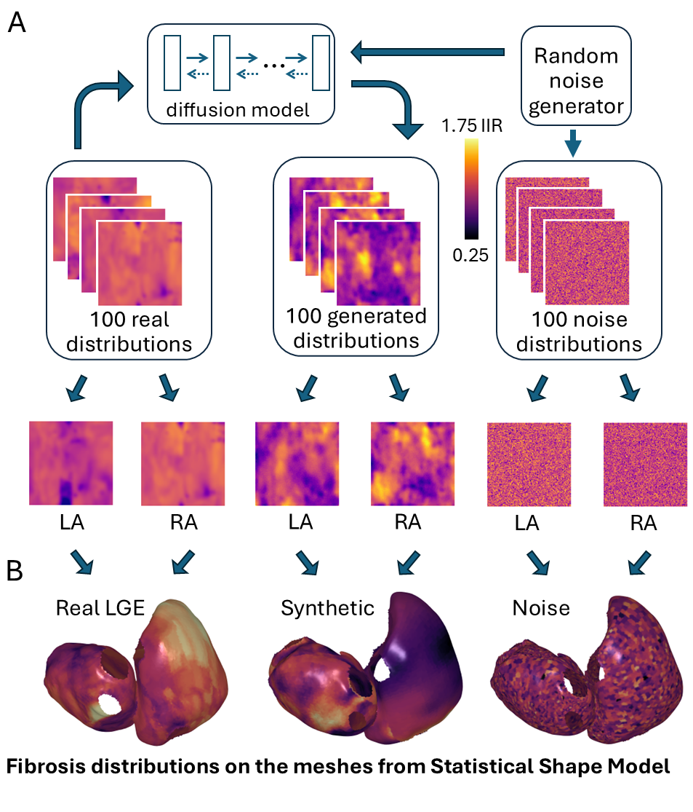
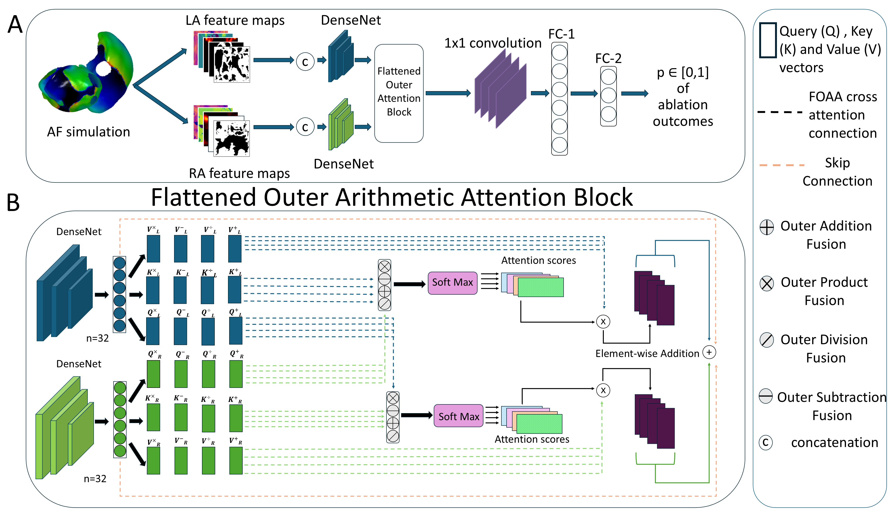

### Synthetic Fibrosis Distributions for Data Augmentation in Predicting Atrial Fibrillation Ablation Outcomes: an In-silico Study

The paper is under consideration in Frontiers in Cardiovascular Medicine.

  ### Abstract

Cardiac fibrosis influences atrial fibrillation (AF) progression and ablation outcomes, with Late Gadolinium Enhancement (LGE) MRI providing a non-invasive tool to measure fibrosis distributions. 
While deep learning (DL) has shown promise in predicting ablation success, training such pipelines is limited by the availability of real patient data.
In this study, we generated synthetic fibrosis distributions using a Denoising Diffusion Probabilistic Model trained on a collection of 100 real LGE-MRI distributions.
We incorporated them into 1000 bi-atrial meshes derived from a statistical shape model and simulated AF episodes on them before and after various ablation strategies to expand training dataset for DL-based outcome prediction. 
Our approach aims to improve the predictive performance of the DL pipeline by enhancing dataset diversity and better capturing patient variability.



We showed that the fibrosis distributions generated by the diffusion model closely resemble real LGE-MRI distributions, based on metrics such as mean intensities and average Shannon entropy. 
AF biophysical simulations can be effectively conducted on bi-atrial meshes incorporating these synthetic distributions. 
Training the deep learning pipeline on these simulations produces performance metrics comparable to those achieved with real LGE-MRI distributions (ROC-AUC = 0.952 vs. 0.943).
We have shown the ability of synthetic fibrosis distributions to be a data augmentation tool for deep learning classification of outcomes of various ablation strategies, which may enable rapid and precise assessment of Atrial Fibrillation treatment strategies.


### Proposed architecture

To address the problem of fast and correct prediction of AF ablation, we propose a DL pipeline based on Siamese architecture.
Each head consists of DenseNet121 network and utilises 4 channel-wisely concatenated feature maps (all of the size 128 by 128 pixels) from left and right atrium separately.
The outputs of both heads (n = 32 each) were fed into a Multi-modal Outer Arithmetic Block (MOAB) or Flatten for the fusion of latent representations of features.
It allows us to capture and combine the relevant features from different anatomical structures by applying four arithmetic operations. 
The resulting arrays were concatenated into multi-modal tensor which passed through the 2D convolution layer.
The final prediction of AF ablation outcome as the probability of AF termination was achieved through two successive fully-connected layers (n = 1089 and 512 respectively) and one dropout layer.



## Running code 


```
pip install -r requirements.txt
python3 ablation_pred.py config_FOAA.yaml name_of_experiment
```
## Improvements over previous works

We utilised a previously proposed generation architecture \citep{Zolotarev_CinC} which was the first to our knowledge implementation of the diffusion model for fibrosis generation.
However, the number of cases there was limited to 100, we did not perform Shannon entropy analysis and we aimed to predict only PVI ablation outcomes by calculating only the dominant frequency feature maps.
More recently we have developed a deep learning pipeline with a multi-modal fusion of feature maps from AF simulation before any ablation to predict the outcomes of various types of ablation strategies \citep{zolotarev2024predicting}.
Our current work combines the best approaches of these two works with key improvements as follows:

    * We have changed the deep learning pipeline to predict ablation outcomes for all ablation strategies at once (binary classification for four ablation strategies together rather than for each one separately).
    * We have tested a new convolutional neural network (ConvNeXt) and a new multi-modal fusion (FOAA) block.
    * We have separated 1000 bi-atrial meshes and fibrosis distributions into training, validation and testing sets to avoid data leakage.
